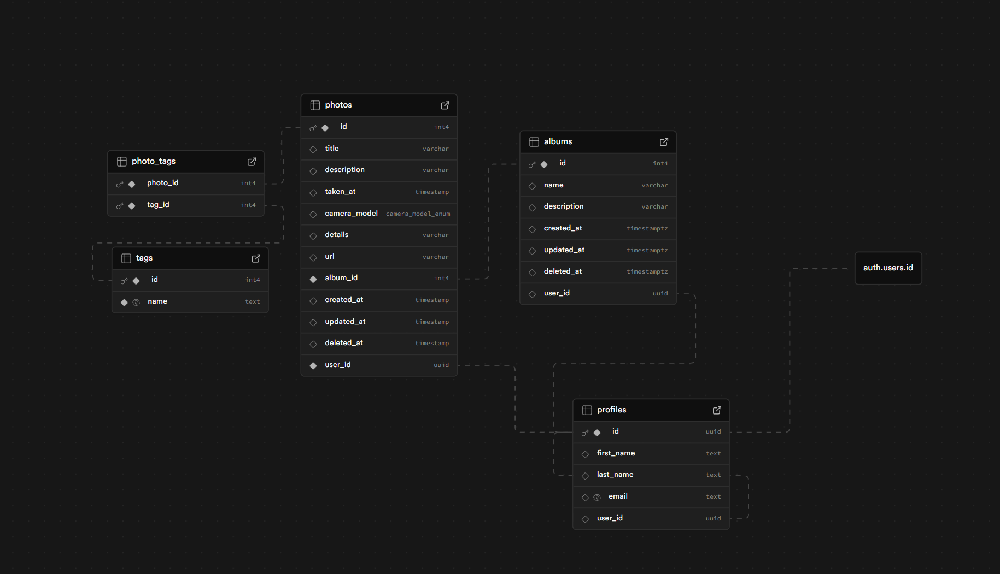

# Photo Library App
#### About The Project:

Photo Library is a web application where users can showcase their creativity. They can create albums, upload photos, and view all uploaded images of all users on the homepage. 

### Key highlights:

Users can create albums and upload multiple photos.
Homepage displays all images uploaded by all users.
Supports individual access control for albums and photos.
Clean, responsive UI built for desktop and mobile.

### Built With

* [Next.js]
* [React.js]
* [Tailwind.com]
* [Supabase.com]
* [Shadcn.com]

## Getting Started

Follow these instructions to set up the project locally.

### Installation

1. Signup to Supabase and get your API Keys
2. Clone the repo
   ```sh
   git clone https://github.com/alfonso-marquez/go-rocky-exam.git
   ```
3. Install NPM packages
   ```sh
   npm install
   ```
4. Copy env.example to env.local
   ```js
   cp env.example env.local
   ```
5. Enter your Supabase credentials and Storage Bucket to your env.local

NEXT_PUBLIC_SUPABASE_URL=your_supabase_url
NEXT_PUBLIC_SUPABASE_ANON_KEY=your_supabase_anon_key
NEXT_PUBLIC_SUPABASE_BUCKET

6.Create the database schema and run migrations



7. Set up RLS (Row Level Security) policies
   
6. Run the development server:
```sh
npm run dev
```

### Scripts
"scripts": {
  "lint": "eslint",
  "lint:fix": "eslint --fix",
  "format": "prettier --check .",
  "format:fix": "prettier --write ."
}

### Demo: (https://go-rocky-exam.vercel.app/)

### Usage

1. Register and log in.  
2. Confirm your email by clicking the link sent to your inbox.  
3. Create a new album.  
4. Upload photos to your album.  
5. Visit the homepage to view all uploaded images from all users.  
6. Edit or delete albums, photos, or tags as needed.  
7. Add tags to your photos.

<!-- MARKDOWN LINKS & IMAGES -->
<!-- https://www.markdownguide.org/basic-syntax/#reference-style-links -->
[Next.js]: https://img.shields.io/badge/next.js-000000?style=for-the-badge&logo=nextdotjs&logoColor=white
[Next-url]: https://nextjs.org/
[React.js]: https://img.shields.io/badge/React-20232A?style=for-the-badge&logo=react&logoColor=61DAFB
[React-url]: https://reactjs.org/
[Tailwind-url]: https://tailwindcss.com/
[Supabase-url]: https://supabase.com/
[Shadcn-url]: https://ui.shadcn.com/


